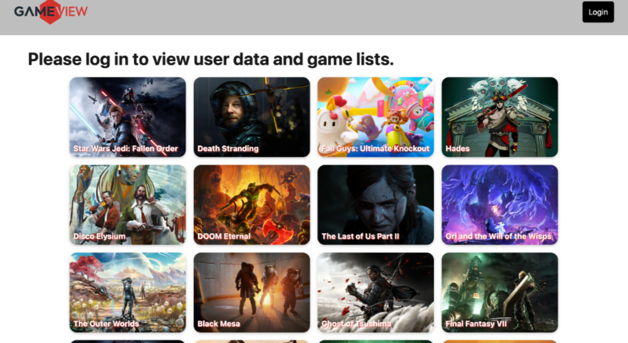
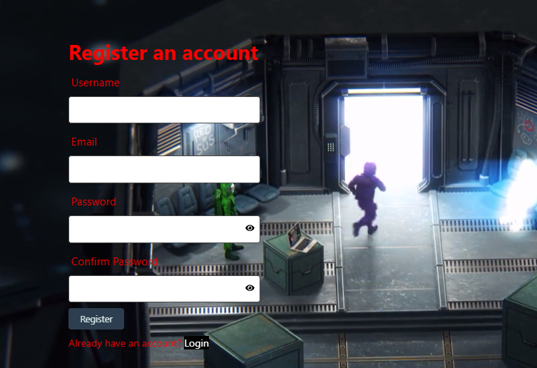
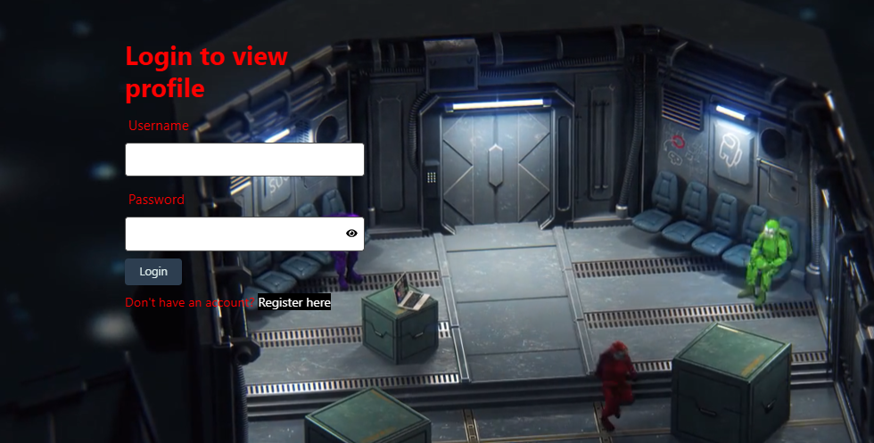
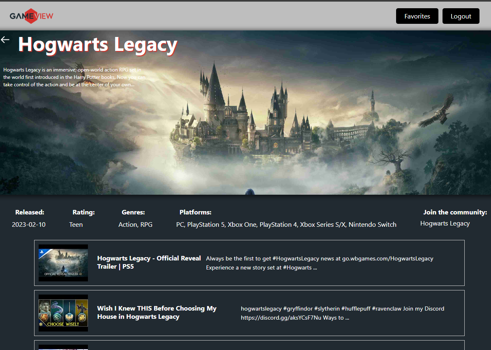
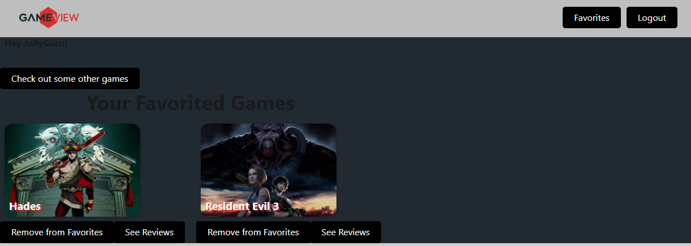

  # Title
   <h1>GameView </h1>
   

  ## Table of Contents

  - [Description](#description)
  - [Design](#design)
  - [Install](#install)
  - [Contributor](#contributor)
  - [License](#license)
  - [Questions](#questions)

  ## Description

   A web page for users to look up game titles. They can create an account to  login and and save thier favorites. A user can search on a game, click the card and get information and reviews. They then have the option to save as a favorite. 

  ## Design

    The application was designed to give a gamer a centeral location to search for games and view comments and informtion. They are able to create a login profile so they can search and save games as their favorites. 

  ## Install

    npm run start

  ## Contributor

   jesseswanton, Petrichor4, Aaronnji, mvoid

  ## License

    This is not licensed  

  ### Questions

  If you have any questions, please contact me at: [] . 

 Our GitHub profile is [https://github.com/jesseswanton/GameView](https://guthub.com/).

  Thank you for visiting my repository!